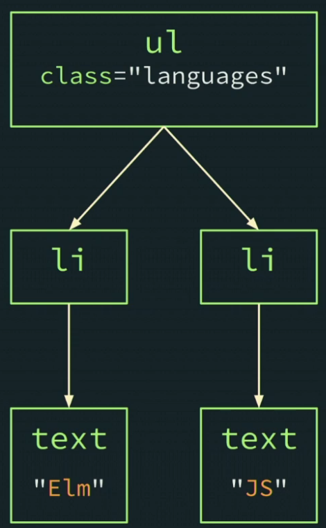
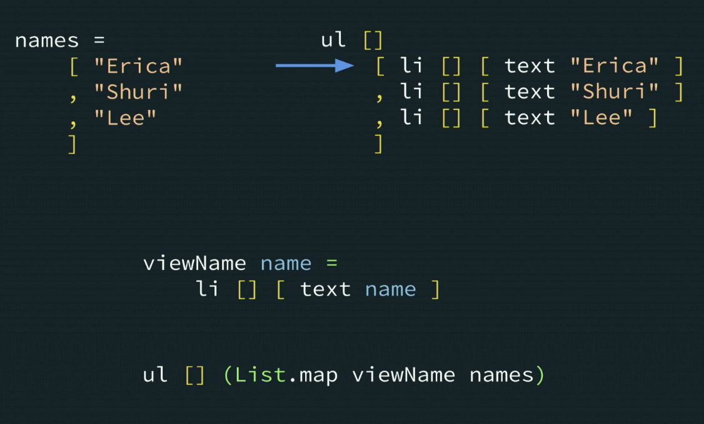
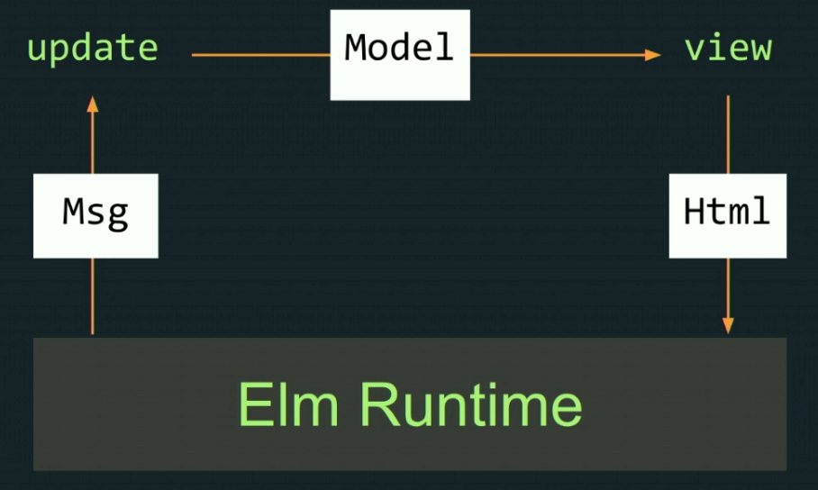
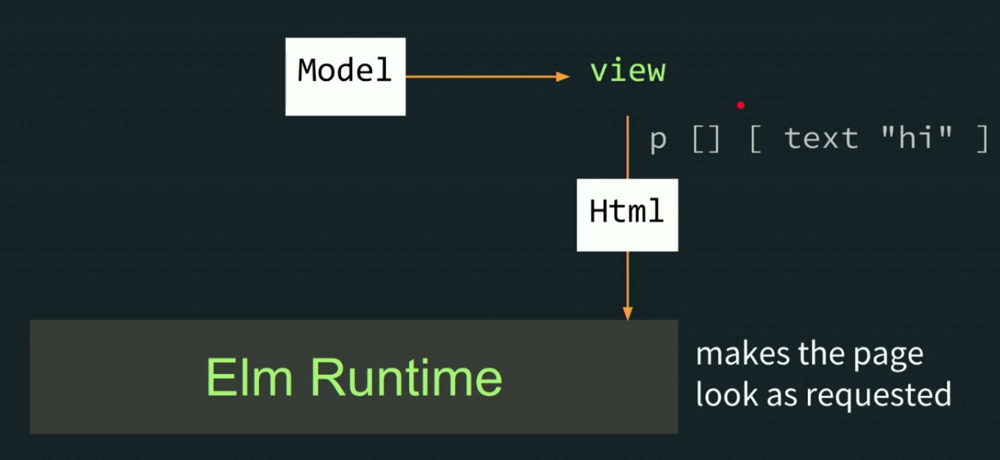

`sudo npm install -g elm elm-test elm-format`

`elm repl` opens up an interactive programming session

https://frontendmasters.com/courses/intro-elm/

https://guide.elm-lang.org/

https://www.reddit.com/r/elm/comments/g1nonf/is_it_still_useful_to_learn_elm/fngpizy?utm_source=share&utm_medium=web2x&context=3

https://www.reddit.com/r/elm/comments/g1nonf/is_it_still_useful_to_learn_elm/fngpz49?utm_source=share&utm_medium=web2x&context=3

---

# Introduction to Elm, v2

## Introduction

There are several languages which compile to JS. CoffeeScript, Babel, TypeScript, Elm, ... 

Some of these are syntactically similar to JS. Elm is not.

## Costs & Benefits

**Costs**

- Not a cousin of JS - new syntax to learn
- Smaller ecosystem (no npm)
- Fewer web APIs have 1st class support

**Benefits**

Measurable technical advantages

- Bundles down small (preact, svelte, raw JS territory) vs. heavy frameworks like React, Angular, Vue
- Fewer runtime exceptions. Good compiler.

Makes hiring easier

- ???

Cohesive, high-quality ecosystem

- JS projects require a lot of hard decisions: Which dialect of React? - JS or TS, Babel? Which UI framework? - React, Vue, vanilla JS? What about state? Utilities? etc. Is it all compatible?
- Elm has a single ecosystem to handle everything

## Workshop Structure 

https://github.com/gothinkster/realworld

https://github.com/rtfeldman/elm-0.19-workshop/tree/master/intro

`Main.elm` compiles to `elm.js`

`elm make Main.elm --output elm.js` 

## Functions & if expressions

A fn in JS:

```js
let pluralize = 
    (sinular, plural, quantity) => {
        if (quantity === 1){
            return singular;
        } else {
            return plural;
        }
    };
```

Equivalent fn in Elm:

```elm
pluralize singular plural quantity =
	if quantity == 1 then
		singular
		
	else 
		plural
```

## Nested Function Expressions

Using the `pluralize` function in Elm:

```Elm
main = -- this is an inline comment
	text (pluralize "leaf" "leaves" 1)
```

parenthesis are used to disambiguate 

## Smart Compile Errors

Elm, like TS, catches a lot of errors at compile time.

Elm has type inference running everywhere. Really, everywhere! There's no `<any>` escape hatch that we have in TS!

## Virtual DOM

HTML describes the DOM structure.

e.g.

```html
<ul class="languages">
    <li>Elm</li>
    <li>JS</li>
</ul>
```

= this DOM tree:



in Elm, we do it all with functions calls:

```elm
ul [ class "languages" ] 
  [ li [] [ text "Elm" ] 
  ,	li [] [ text "JS" ] -- commas on the left 
]
```

`elm-format` will do it like this!

## Intro Review + Q&A

**todo - get my tryElm working**

## Rendering a Page Exercise

[part1 exercise](./elm-0.19-workshop/intro/part1)

## Strings 

```elm
"foo" ++ "bar" -> "foobar" -- concatenation
```

`String.fromInt` to convert integers to strings 

```elm
String.fromtInt quantity ++ " " ++ singular
```

## let Expressions

```elm
pluralize singular plural quanity = 
	let
		quantityStr = 
			String.fromtInt quantity
			
		prefix = 
			quantityStr ++ " "
	in
	if quantity == 1 then
		prefix ++ singular
		
	else
		prefix ++ plural
```

^ indentation matters in Elm

## Lists

```elm
[ 1, 2, 3 ] -- under the hood it's an immuatable linked list 
```

```elm
[ "foo", 65 ] -- will not compile in Elm
```

One data type only. Stops problems like this in JS:

```js
["pow", "zap", "blam", 500].map(
	(str) => { return str.toUpperCase() + "!" }
)
// [ "POW!", "ZAP!", "BLAM!" ] for first 3 elements, then error!
// toUpperCase exists only for strings
```

## Anonymous Functions

```elm
List.map (\str -> String.toUpper str ++ "!")
	[ "pow", "zap", "blam" ]
-- [ "POW!", "ZAP!", "BLAM!" ]
```

## Partial Application

```elm
List.map (pluralize "leaf" "leaves") [ 0, 1, 2 ] -- forget the 3rd arg "num"

-- Elm returns this:
(\num -> pluralize "leaf" "leaves" num)

-- An anonymous fn with num to be provided once we have it
```

## Render a List to a View



## Manipulating Values Exercise

[part2 exercise](./elm-0.19-workshop/intro/part2)

## Records

https://frontendmasters.com/courses/intro-elm/records/

```elm
record =
	{ name = "foo", x = 1, y = 3 }
-- same as JS except '=' instead of ':'

record.name -- ---> "foo"
record.x -- ---> 1
-- etc.
```

no prototypes, no **this**, no mutating - records hold plain, immutable data.

```elm
newRecord = 
	{ name = "bar" 
	, x = 1 
	, y = 3
	}
-- define using vertical layout with commas at start 
```

## Record Iteration

|             | **iteration** | **mixed entries** |
| ----------- | ------------- | ----------------- |
| **lists**   | supported     | unsupported       |
| **records** | unsupported   | supported         |

## Booleans

`True`, `False` - capitalised

```elm
x == y
not (x == y) -- ! in JS
x /= y -- also !=
x || y
x && y
```

## Boolean Operations

```elm
List.member 1 [ 1, 2, 3 ] -- is 1 a member of this list?
	True
	
List.member 9 [ 1, 2, 3 ]
	False
```

```elm
-- trying $ elm repl
> l = [ 1, 2, 3 ]
[1,2,3] : List number
> isKeepable num = 
l       :exit   :help   :quit   :reset
> isKeepable num =
|   num > 1
<function> : number -> Bool
> isKeepable
<function> : number -> Bool
> List.filter isKeepable l
[2,3] : List number
```

```elm
-- or inline with an anonymous fn
List.filter (\num -> num > 1 ) [ 1, 2, 3 ]
-- [2, 3]
```

## The Elm Architecture



This runtime is bundled into the output JS everytime `make` is run.



## The Elm Architecture: Update

```elm
update msg model = 
	{ model | selectedTag = "elm" }
-- keep model the same, but update selectedTag
```

```elm
-- e.g. of a msg
msg = {
	description = "ClickedTag"
	, data = "elm"
	}
```

```elm
-- update msg model
button
	[ onClick
    	{ description = "ClickedTag" 
    	, data = "elm"
    	}
	]
	[ text "elm" ]
```

## Interaction Exercise

[part 3 exercise](./elm-0.19-workshop/intro/part3)

`elm install <package name>`


