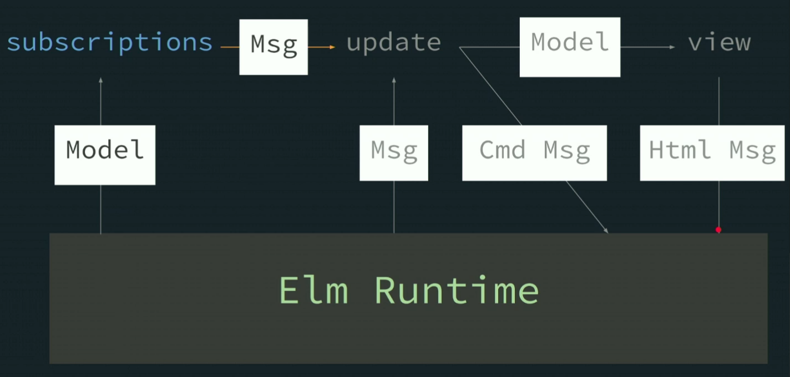

# Introduction to Elm, v2

My notes on the FEM course - https://frontendmasters.com/courses/intro-elm/

Install elm: `sudo npm install -g elm elm-test elm-format`

`elm repl` opens up an interactive programming session

## Contents

- [Introduction to Elm, v2](#introduction-to-elm-v2)
  * [Contents](#contents)
  * [Course Introduction](#course-introduction)
    + [Introduction](#introduction)
    + [Costs & Benefits](#costs--benefits)
    + [Workshop Structure](#workshop-structure)
  * [Elm Introduction](#elm-introduction)
    + [Functions & if expressions](#functions--if-expressions)
    + [Nested Function Expressions](#nested-function-expressions)
    + [Smart Compile Errors](#smart-compile-errors)
    + [Virtual DOM](#virtual-dom)
    + [Rendering a Page Exercise](#rendering-a-page-exercise)
  * [Manipulating Values](#manipulating-values)
    + [Strings](#strings)
    + [let Expressions](#let-expressions)
    + [Lists](#lists)
    + [Anonymous Functions](#anonymous-functions)
    + [Partial Application](#partial-application)
    + [Render a List to a View](#render-a-list-to-a-view)
    + [Manipulating Values Exercise](#manipulating-values-exercise)
  * [Interaction](#interaction)
    + [Records](#records)
    + [Record Iteration](#record-iteration)
    + [Booleans](#booleans)
    + [Boolean Operations](#boolean-operations)
    + [The Elm Architecture](#the-elm-architecture)
    + [The Elm Architecture: Update](#the-elm-architecture-update)
    + [Interaction Exercise](#interaction-exercise)
  * [Type Annotations](#type-annotations)
    + [Type Annotation Overview](#type-annotation-overview)
    + [Primitives & Records](#primitives--records)
    + [Parameters](#parameters)
    + [Aliases](#aliases)
    + [HTML Msg](#html-msg)
    + [Functions](#functions)
    + [Type Annotations Exercise](#type-annotations-exercise)
  * [Custom Types](#custom-types)
    + [Case Expressions](#case-expressions)
    + [Variants & Booleans](#variants--booleans)
    + [Custom Types in Case Expressions](#custom-types-in-case-expressions)
    + [Containers](#containers)
    + [Custom Types in Messages](#custom-types-in-messages)
    + [Custom Types Exercise](#custom-types-exercise)
  * [Maybe](#maybe)
    + [Maybe Overview](#maybe-overview)
    + [Type Variables](#type-variables)
    + [Pipelines & Review](#pipelines--review)
    + [Maybe & Pipelines Exercise](#maybe--pipelines-exercise)
  * [Decoding JSON](#decoding-json)
    + [Decoding](#decoding)
    + [Pipeline Decoding:](#pipeline-decoding)
    + [Optional & Nullable](#optional--nullable)
    + [Decoding JSON Exercise](#decoding-json-exercise)
  * [Talking to Servers](#talking-to-servers)
    + [Tuples](#tuples)
    + [Function Guarantees, Randomness & Commands](#function-guarantees-randomness--commands)
    + [Browser.element](#browserelement)
    + [Pure Functions](#pure-functions)
    + [HTTP.getString](#httpgetstring)
    + [Http.get & Pattern Matching](#httpget--pattern-matching)
    + [Talking to Servers Exercise](#talking-to-servers-exercise)
  * [Talking to JavaScript](#talking-to-javascript)
    + [Subscriptions](#subscriptions)
    + [The JavaScript Ecosystem](#the-javascript-ecosystem)
    + [Unbound Type Variables](#unbound-type-variables)
    + [port Modules, localForage & Review](#port-modules-localforage--review)
    + [Talking to JS Exercise](#talking-to-js-exercise)
  * [Wrapping Up](#wrapping-up)
    + [Review](#review)
    + [Resources](#resources)

## Course Introduction

### Introduction

There are several languages which compile to JS. CoffeeScript, Babel, TypeScript, Elm, ... 

Some of these are syntactically similar to JS. Elm is not.

### Costs & Benefits

**Costs**

- Not a cousin of JS - new syntax to learn
- Smaller ecosystem (no npm)
- Fewer web APIs have 1st class support

**Benefits**

Measurable technical advantages

- Bundles down small (preact, svelte, raw JS territory) vs. heavy frameworks like React, Angular, Vue
- Fewer runtime exceptions. Good compiler.

Makes hiring easier

- ???

Cohesive, high-quality ecosystem

- JS projects require a lot of hard decisions: Which dialect of React? - JS or TS, Babel? Which UI framework? - React, Vue, vanilla JS? What about state? Utilities? etc. Is it all compatible?
- Elm has a single ecosystem to handle everything

### Workshop Structure 

https://github.com/gothinkster/realworld

https://github.com/rtfeldman/elm-0.19-workshop/tree/master/intro

`Main.elm` compiles to `elm.js`

`elm make Main.elm --output elm.js` 

## Elm Introduction

### Functions & if expressions

A fn in JS:

```js
let pluralize = 
    (sinular, plural, quantity) => {
        if (quantity === 1){
            return singular;
        } else {
            return plural;
        }
    };
```

Equivalent fn in Elm:

```elm
pluralize singular plural quantity =
	if quantity == 1 then
		singular
		
	else 
		plural
```

### Nested Function Expressions

Using the `pluralize` function in Elm:

```Elm
main = -- this is an inline comment
	text (pluralize "leaf" "leaves" 1)
```

parenthesis are used to disambiguate 

### Smart Compile Errors

Elm, like TS, catches a lot of errors at compile time.

Elm has type inference running everywhere. Really, everywhere! There's no `<any>` escape hatch that we have in TS!

### Virtual DOM

HTML describes the DOM structure.

e.g.

```html
<ul class="languages">
    <li>Elm</li>
    <li>JS</li>
</ul>
```

= this DOM tree:


in Elm, we do it all with functions calls:

```elm
ul [ class "languages" ] 
  [ li [] [ text "Elm" ] 
  ,	li [] [ text "JS" ] -- commas on the left 
]
```

`elm-format` will do it like this!

### Rendering a Page Exercise

[part 1 exercise](./elm-0.19-workshop/intro/part1)

## Manipulating Values

### Strings 

```elm
"foo" ++ "bar" -> "foobar" -- concatenation
```

`String.fromInt` to convert integers to strings 

```elm
String.fromtInt quantity ++ " " ++ singular
```

### let Expressions

```elm
pluralize singular plural quanity = 
	let
		quantityStr = 
			String.fromtInt quantity
			
		prefix = 
			quantityStr ++ " "
	in
	if quantity == 1 then
		prefix ++ singular
		
	else
		prefix ++ plural
```

^ indentation matters in Elm

### Lists

```elm
[ 1, 2, 3 ] -- under the hood it's an immuatable linked list 
```

```elm
[ "foo", 65 ] -- will not compile in Elm
```

One data type only. Stops problems like this in JS:

```js
["pow", "zap", "blam", 500].map(
	(str) => { return str.toUpperCase() + "!" }
)
// [ "POW!", "ZAP!", "BLAM!" ] for first 3 elements, then error!
// toUpperCase exists only for strings
```

### Anonymous Functions

```elm
List.map (\str -> String.toUpper str ++ "!")
	[ "pow", "zap", "blam" ]
-- [ "POW!", "ZAP!", "BLAM!" ]
```

### Partial Application

```elm
List.map (pluralize "leaf" "leaves") [ 0, 1, 2 ] -- forget the 3rd arg "num"

-- Elm returns this:
(\num -> pluralize "leaf" "leaves" num)

-- An anonymous fn with num to be provided once we have it
```

### Render a List to a View


### Manipulating Values Exercise

[part 2 exercise](./elm-0.19-workshop/intro/part2)

## Interaction

### Records

https://frontendmasters.com/courses/intro-elm/records/

```elm
record =
	{ name = "foo", x = 1, y = 3 }
-- same as JS except '=' instead of ':'

record.name -- ---> "foo"
record.x -- ---> 1
-- etc.
```

no prototypes, no **this**, no mutating - records hold plain, immutable data.

```elm
newRecord = 
	{ name = "bar" 
	, x = 1 
	, y = 3
	}
-- define using vertical layout with commas at start 
```

### Record Iteration

|             | **iteration** | **mixed entries** |
| ----------- | ------------- | ----------------- |
| **lists**   | supported     | unsupported       |
| **records** | unsupported   | supported         |

### Booleans

`True`, `False` - capitalised

```elm
x == y
not (x == y) -- ! in JS
x /= y -- also !=
x || y
x && y
```

### Boolean Operations

```elm
List.member 1 [ 1, 2, 3 ] -- is 1 a member of this list?
	True
	
List.member 9 [ 1, 2, 3 ]
	False
```

```elm
-- trying $ elm repl
> l = [ 1, 2, 3 ]
[1,2,3] : List number
> isKeepable num = 
l       :exit   :help   :quit   :reset
> isKeepable num =
|   num > 1
<function> : number -> Bool
> isKeepable
<function> : number -> Bool
> List.filter isKeepable l
[2,3] : List number
```

```elm
-- or inline with an anonymous fn
List.filter (\num -> num > 1 ) [ 1, 2, 3 ]
-- [2, 3]
```

### The Elm Architecture


This runtime is bundled into the output JS everytime `make` is run.


### The Elm Architecture: Update

```elm
update msg model = 
	{ model | selectedTag = "elm" }
-- keep model the same, but update selectedTag
```

```elm
-- e.g. of a msg
msg = {
	description = "ClickedTag"
	, data = "elm"
	}
```

```elm
-- update msg model
button
	[ onClick
    	{ description = "ClickedTag" 
    	, data = "elm"
    	}
	]
	[ text "elm" ]
```

### Interaction Exercise

[part 3 exercise](./elm-0.19-workshop/intro/part3)

`elm install <package name>`

## Type Annotations

### Type Annotation Overview

```elm
username : String
username = "rtfeldman"
```

Considered best practice to use them at least for your top-level declarations.

### Primitives & Records

```elm
totalPages : Int
totalPages = 5

isActive : Bool
isActive = True
```

```elm
add : Int -> Int -> Int
add a b =
    a + b
```

```elm
-- ":" is for types
searchResult : { name : String, stars: Int }
-- "=" is for values
searchResult = { name = "blah", starts = 215 }
```

### Parameters

```elm
names : List Strings -- names is a list of strings
-- Lists are a parameterized type. Lists need a type!
names = [ "Sam", "Casey", "Pat" ]

names : List Float
names = [ 1.1, 2.2, 3.3 ]

-- etc.
```

### Aliases

```elm
type alias Article = 
	{ title : String
	, tags : List String
	, body : String
	}
	
type alias Model = 
	{ selectedTag : String
	, articles : List Article
	}
	
-- more concise than writing a nested obj
```

### HTML Msg

```elm
view model = 
	button
		[ onClick 
			{ description = "ClickedClear" 
			, data = "ALL"
			}
		]
		[ text "X" ]
```

We don't have to pass a record message. It can be simplified to:

```elm
view : Model -> Html String
view model = 
	button [ onClick "ClickedClear" ] [ text "X" ]
```

as long as you are consistent with your format, e.g. `Html String`.

### Functions

```elm
type alias Msg =
	{ description : String
	, data : String
	}

view : Model -> Html Msg
view model = 


update : Msg -> Model -> Model
update msg model = 
```

### Type Annotations Exercise

[part 4 exercise](./elm-0.19-workshop/intro/part4)

## Custom Types

### Case Expressions 

```elm
case model.tab of
	"YourFeed" -> 
		-- show Your Feed
	"GlobalFeed" ->
		-- show Global Feed
	_ ->
		-- show Tag Feed
```

### Variants & Booleans

```elm
type Tab =
	YourFeed | GlobalFeed | TagFeed -- custom type
```

could be implemented like:

```elm
yours : Tab
yours = 
	YourFeed
	
global : Tab
global = 
	GlobalFeed

tag : Tab
tag =
	TagFeed
```

Bool is actually a custom type:

```elm
type Bool
	= True
	| False
```

### Custom Types in Case Expressions

```elm
case model.tab of
	YourFeed -> 
		-- show your feed
	GlobalFeed ->
		-- show global feed
	TagFeed ->
		-- show tag feed
	
	-- no default case is better in Elm
```

### Containers

```elm
type Tab
	= YourFeed
	| GlobalFeed
	| TagFeed String
```

```elm
yours : Tab
yours =
	YourFeed
	
happiness : Tab
happiness = 
	TagFeed "happiness" -- must pass string now
```

```elm
case model.tab of
	YourFeed -> 
		-- show your feed
	GlobalFeed ->
		-- show global feed
	TagFeed selectedTag -> -- e.g. passing in "happiness"
		-- show tag feed
```

Now `Tab` is a container that situation-ally holds information (when on TagFeed).

"Custom types are the most important feature of Elm"
	-- The creator of Elm

### Custom Types in Messages

```elm
type alias Msg = 
	{ description : String
	, stringData : String
	, intData : Int
	}
	
	{ description : "ClickedTag"
	, stringData : "cars"
	, intData : -1 -- need to set to sth like -1 because we don't need it
	}
	
	{ description : "ClickedPage"
	, stringData : "" -- need to set to "" because we don't need it
	, intData : 2
	}
```

^ This is what happens when you use records as messages in Elm. You end up fudging the record so it interacts properly.

Consider this, instead:

```elm
type Msg
	= clickedTag String
	| clickedPage Int
```

^ We clicked *either* a tag or a page.

```elm
update msg model = 
	case msg of
		ClickedTag selectedTag ->
			-- use tag here
		ClickedPage page ->
			-- use page here
```

Custom types work great with messages!

 ```elm
type Msg
	= clickedTag String
	| clickedPage Int
	
pageButton : Int -> Html Msg
pageButton pageNumber = 
	button [ onClick (ClickedPage pageNumber) ] [ text (String.fromInt pageNumber) ]
 ```

### Custom Types Exercise 

[part 5 exercise](./elm-0.19-workshop/intro/part5)

`elm make src/Main.e
lm --output ../server/public/elm.js`

run server from `/intro/server` :

```
npm install
npm start
```

## Maybe

### Maybe Overview

consider this JS snippet:

```js
> first = (users) => {
... return users[0];
... }
[Function: first]
> first(["Sam", "Jess"])
'Sam'
> first([])
undefined

> const newUsers = ["Sam", "Jess"]
undefined
> first(newUsers).length
3
// but if newUsers = [], we'd get an error: Uncaught TypeError: Cannot read property 'length' of undefined
```

and in Elm:

```elm
> first users = List.head users
<function> : List a -> Maybe a
> first ["Sam", "Jess"]
Just "Sam" : Maybe String
> first []
Nothing : Maybe a

> newUsers = ["Sam", "Jess"]
["Sam","Jess"] : List String
> case first newUsers of
|   Just user ->
|       String.length user
|   Nothing ->
|       0
3 : Int
-- or 0 when newUsers = []
-- because we define the [] case, we don't get an error like in JS
```

### Type Variables

```elm
> List.head [ "Sam", "Jess" ]
Just "Sam" : Maybe String
> List.head [ 3.14, 7.77 ]
Just 3.14 : Maybe Float
> List.head [ True, False ]
Just True : Maybe Bool
> -- what type is List.head ???
List.head : List elem -> Maybe elem
```

`elem` is a **Type Variable**

```elm
-- e.g.
List.reverse : List item -> List item
List.reverse   [ 1, 2, 3 ] -> [ 3, 2, 1 ]
```

what is the type of Maybe?

```elm
type Maybe val -- val is a type variable
	= Just val
	| Nothing
```

^ this allows us to have Maybes of different types

### Pipelines & Review

```elm
-- e.g.
> List.reverse (List.filter (\x -> x < 5) [ 2, 4, 6 ])
[4,2] : List number

-- or in pipeline style:
> [ 2, 4, 6 ] 
	|> List.filter(\x -> x < 5) 
	|> List.reverse
[4,2] : List number
```

^ esepcially with big pipelines, sometimes assigning intermediate values and breaking a pipeline up is better!

### Maybe & Pipelines Exercise

[part 6 exercise](./elm-0.19-workshop/intro/part6)

## Decoding JSON

### Decoding

in JS:

```js
parseInt "42" --> 42
parseInt "hi" --> NaN
```

in Elm:

```elm
case String.toInt str of
	Just num ->
		num * 10
	
	Nothing ->
		0
```

```elm
String.toInt "42" --> Just 42
String.toInt "hi" --> Nothing
--
type Maybe val
	= Just val
	| Nothing
```

### Pipeline Decoding:

Consider this JSON:

```json
{
    "user_id": 27,
    "first_name": "Al",
    "last_name": "Kai"
}
```

```elm
type alias User =
	{ id : Int 
	, firstName : String
	, lastName : String
	}
```

Field names don't need to match `user_id --> id` etc.

Types don't need to map too. Can be mapped to a custom type, for example.

Let's write a JSON decoder:

```elm
user : Decoder User
user =
	Json.Decode.succeed User -- if decoding succeeds, use this fn to build the result
		|> required "user_id" int -- Json.Decode.Int
		|> required "first_name" string -- Json.Decode.String
		|> required "last_name" string -- Json.Decode.String
```

### Optional & Nullable

consider this:

```json
{
    "user_id": 27,
    "name": null
}
```

```elm
type alias User =
	{ id : Int
	, name : Maybe String
	, email : String
	}
```

```elm
user : Decoder User
user = 
	Json.Decode.succeed User
		|> required "user_id" int -- null not OK! --> we want to fail
		|> required "name" (nullable string) -- here we say that it can be null, that's OK
		|> optional "email" string "me@foo.com" -- if not present, fallback on default
```

### Decoding JSON Exercise

[part 7 exercise](./elm-0.19-workshop/intro/part7)

## Talking to Servers

### Tuples

Tuples serve the same puropose as records

except with **field positions** instead of **field names**

```elm
x = Tuple.first ( 5, 7 )
( name, x, y ) = ( "foo", 5, 7 ) -- desctructing 

x = { x = 5, y = 7 }.x -- as a record

{ name, x, y } = { name = "foo", x = 5, y = 7 } -- record destructuring -- fields must match!
```

Tuples are limited to 3 elements!

```elm
> a = ( 1, 2, 3, 4 )
-- BAD TUPLE -------------------------------------------------------------- REPL

I only accept tuples with two or three items. This has too many:

2| a = ( 1, 2, 3, 4 )
       ^^^^^^^^^^^^^^
I recommend switching to records. Each item will be named, and you can use the
`point.x` syntax to access them.

Note: Read <https://elm-lang.org/0.19.1/tuples> for more comprehensive advice on
working with large chunks of data in Elm.
```

records and tuples are nothing more than groups of values that travel together.

```elm
animate { name = "foo", x = 1, y = 3 }
-- or 
animate ( "foo", 1, 3 )
-- or
animate "foo" 1 3
```

...but custom types can be much more!

### Function Guarantees, Randomness & Commands

**same** arguments --> **same** return value

in JS:

```js
> Math.random() // returns different result each time
0.8975191363997552
> Math.random()
0.005415975186105371
> Math.random()
0.7246982292936115
```

^ in Elm we have `Random.generate` 

Another example:

```elm
pickGreeting : List String -> String
-- returns same greeting each time; can't use this
```

```elm
pickGreeting : List String -> Cmd Msg
```

**Without commands:**


**With commands:**


*commands* come from *update*

A command is a description of something you want done

`Random.generate` gives us a command message: "runtime, go randomly pick something and send me a message telling me what you've picked"

### Browser.element

`Browser.sandbox`

```elm
update : Msg -> Model -> ( Model, Cmd Msg )
```

### Pure Functions

**same** argument --> **same** result AND fns have **no side effects** (no modifying external state).

Consider a fire-and-forget HTTP POST:

:heavy_check_mark: same args, same result

:x: does not modify external state

^ So elm does **managed effects** - any side effects have to be done through commands. This guarantees every fn in elm is pure.

### HTTP.getString

```elm
getString : String -> Request String -- Request is a description of the params of the HTTP Request, but doesn't handle what could go wrong. Intermediate step to a command.
```

Then, `Http.send`: Request --> Cmd

translate failure into a Msg
	or
translate success into a Msg

```elm
Http.send
	(\result -> CompletedLoadFeed result)
	(Http.getString "/feed?tag=happiness")

-- can write like:
Http.send
	CompletedLoadFeed
	(Http.getString "/feed?tag=happiness")

-- or, as a pipeline:
Http.getString "/feed?tag=happiness"
	|> Http.send CompletedLoadFeed
```

### Http.get & Pattern Matching

```elm
CompletedLoadFeed (Result Error (list Article))

-- success only gives you a String
Http.getString url

-- success gives you a List Article
Http.get articlesDecoder url -- takes additional Decoder arg
	
	-- pattern matching
	case msg of 
		CompletedLoadFeed (Ok articles) ->
			...
		
		CompletedLoadFeed (Err error) ->
			...
```

### Talking to Servers Exercise

[part 8 exercise](./elm-0.19-workshop/intro/part8)

## Talking to JavaScript

### Subscriptions

**Responding to Custom Events**

(Translating JS to Elm)

```elm
on : String -> Decoder msg -> Attribute msg
-- e.g.
div [ on "mousemove" mousePointDecoder ] [...]
```

**Responding to Window Events**

windows don't have attributes...

```elm
Browser.onMouseMove : Decoder msg -> Sub msg
--                               | Subscription |
```

**Subscriptions** are another path to *update* (the brain of the Elm app). They are "event listeners that are global".



e.g. mouse moves, web sockets

### The JavaScript Ecosystem

All Elm functionns are **pure**; not so in JS.

How do we access the enourmous JS ecosystem, while maintaining the guarantees of Elm?

**--> "client/server" communication**

Elm sends data to JS. Js sends data to Elm. No direct function calls.

Cmd on Elm --> callback on JS

Cmd ~~Msg~~ --> Cmd msg (lowercase = a type variable)

Recall: 

```elm
List.head    : List elem -> Maybe elem
List.reverse : List val  -> List val
List.length  : List a    -> Int
```

### Unbound Type Variables

```elm
[ 1.1, 2.2 ] : List Float
[ "a", "b "] : List String
-- etc.
-- what about an empty list [] ?
[] : List a
```

```elm
-- e.g.
String.concat : List String -> String
String.concat [ "ab", "c" ] -> "abc"
String.concat []            -> ""

String.lines : String -> List String
String.lines "A\nB"   -> [ "A", "B" ]
String.lines ""       -> []
```

```elm
[] : List a

div [ onClick Toggle ] [] : Html Msg

img [ src "logo.png" ] [] : Html a -- html with an unbound type variable

img [ src "logo.png" ] [] : Html msg -- also
```

So,

```elm
Cmd Msg
-- produces messages of type Msg
-- works with update functions that accept Msg
```

and

```elm
Cmd msg
-- I don't produce any messages
-- Therefore I work with any update function!
```

So we can talk to JS in a fire-and-forget manner. There's no callback on the Elm side.

### port Modules, localForage & Review

We talk to JS through **ports**, so we need the port module in Elm.

```elm
port storeSession : Maybe String -> Cmd msg -- make me a function that accepts a 'Maybe String', send that to JS, and return a command to do that when executed. Nothing else after that.

port onSessionChange : (String -> msg) -> Sub msg
```

Elm creates the implementation.

On JS side:

```js
var app = Elm.Main.init({flags: session}); // store session 

// subscribe to session command
app.ports.storeSession.subscribe(function(str){
    // ... taking the str (Maybe String) from Elm
});

app.ports.onSessionChange.send(someString); // passing info back to Elm
```

Storing session data in `localForage`

```js
localForage.getItem("key", function(val) { ... })
// or
localForage.setItem("key", "val", function() { ... })
```

Who owns this state? Elm, or JS?

`localForage` owns the session, so for us: JS owns the state; Elm caches it.

### Talking to JS Exercise

[part 9 exercise](./elm-0.19-workshop/intro/part9)

## Wrapping Up

### Review

- Elm compiles to JS.

- Used by: 


- "No runtime exceptions"

- Incremental adoption - try Elm on one page, get into production, do we like it? That's how most people start off and end up adopting Elm.

- Elm Architecture
  
  

### Resources

- https://github.com/rtfeldman/elm-spa-example - final version of elm demo app
- https://guide.elm-lang.org/
- his book - https://www.manning.com/books/elm-in-action
- http://elmlang.herokuapp.com/ - Elm slack community
- https://discourse.elm-lang.org/ - Elm forum
- https://faq.elm-community.org/
- https://player.fm/series/elm-town - Elm Town podcast